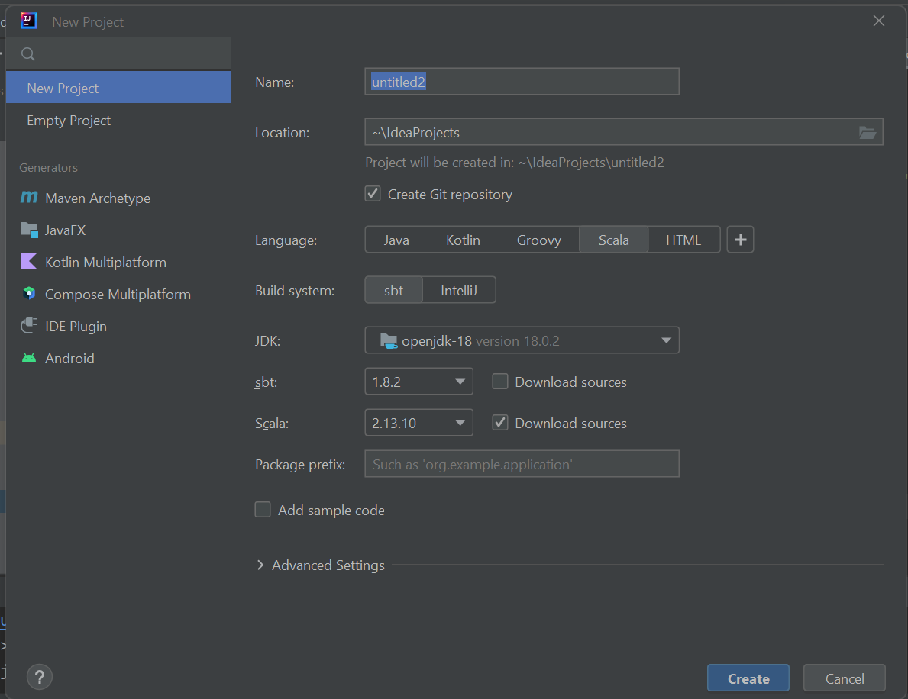

# level2

Just practicing some of the scala things as mentioned in my to do list of this week 

# Create a new project with sbt

Steps:- 
    1) First give the name of your application.  
    2) Choose the location where you want to save your project.  
    3) Select scala as a language.  
    4) Choose sbt as build tool.  
    5) Select preferred version of sbt and scala.  
    6) And off we go, Now click on create button.  
